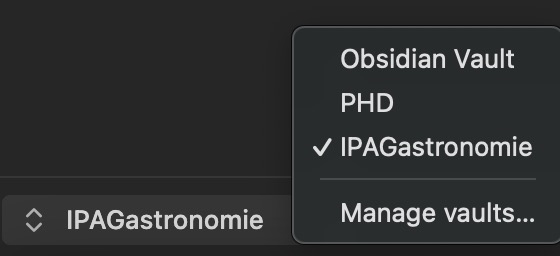
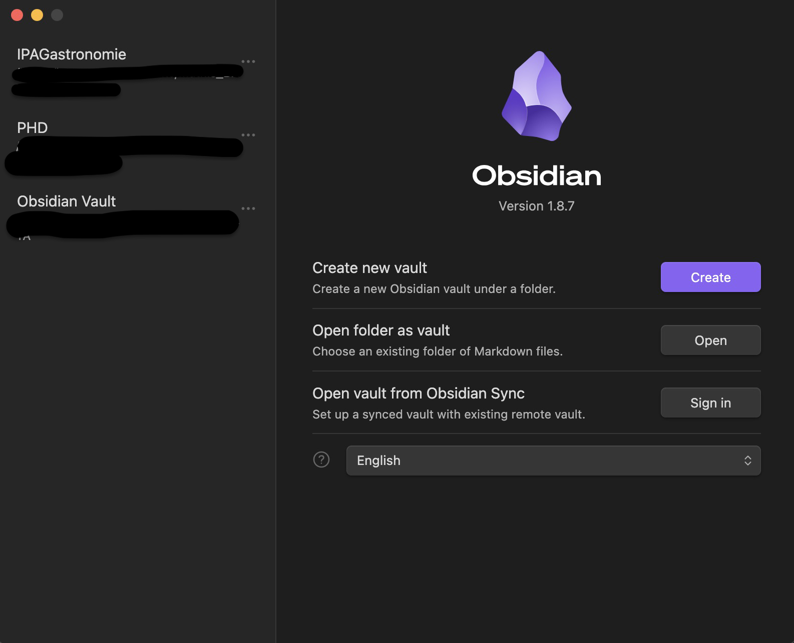
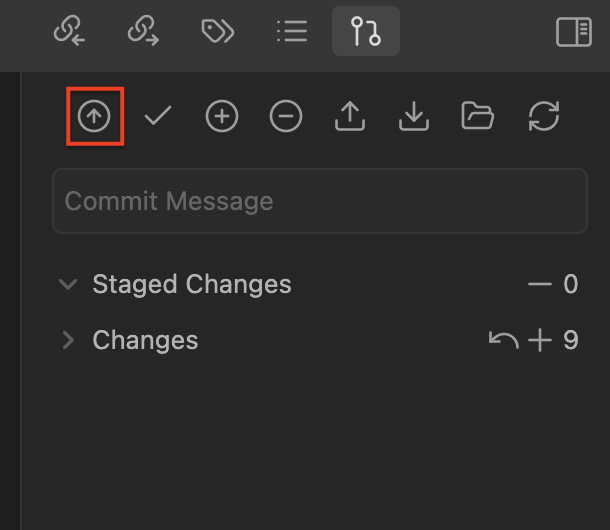
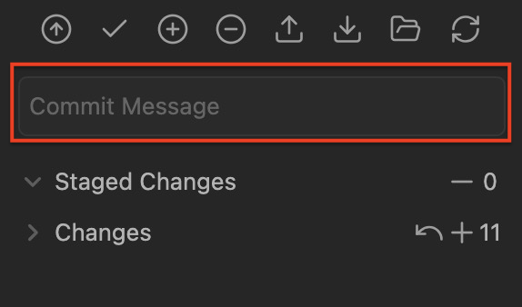
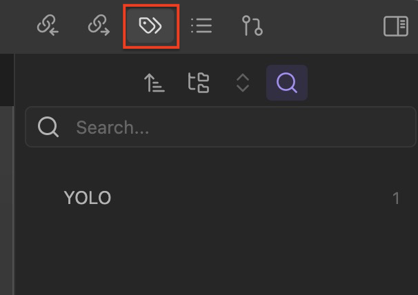
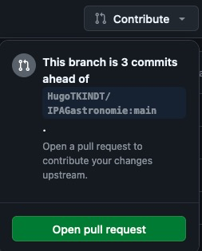

IPAGastronomie
==============

Ce repo git a pour but de mettre en commun des recettes pour les doctorants de l'IPAG. La solution adoptée dans un premier lieu est de tout faire sur LaTeX, si vous avez d'autres propositions gratuites qui ne nécessite pas d'installation lourdes vous pouvez les suggérer. Vous pouvez aussi suggérer des améliorations sur la mise en forme et le template. Le but est que chacun puisse ajouter ses propres recettes pour au final donner un pdf complet et agréable à lire pour que chacun puisse cuisiner ce qu'il veut !

Prérequis
---------

- Obsidian

Structure
---------

Le projet est organisé d'une façon qui permettra de d'ajouter/supprimer/modifier simplement une seule recette sans avoir un main.tex à rallonge. La structure des dossiers est faite pour pouvoir organiser les différents types de recettes (sucrées, salées, végé, végans, etc) au mieux et pour limiter la confusion lorsqu'il y en aura beaucoup. S'il vous plait, suivez cette structure de dossier afin d'éviter les conflits lors de la compilation du main.tex :

- `Salé/`:
  - `Salé/Végé/`: Contient tous les fichiers (au format .md) des recettes salées et végétariennes
  - `Salé/Végan/`: Contient tous les fichiers (au format .md) des recettes salées et végans
  - `Salé/Autre/`: Contient tous les fichiers (au format .md) des recettes salées et non végétariennes ou végans
- `Sucré/`:
  - `Sucré/Végé/`: Contient tous les fichiers (au format .md) des recettes sucrées et végétariennes
  - `Salé/Végan/`: Contient tous les fichiers (au format .md) des recettes sucrées et végans
  - `Salé/Autre/`: Contient tous les fichiers (au format .md) des recettes sucrées et non végétariennes ou végans
  

Comment contribuer
==================

Les contributions à ce dépôt sont les bienvenues. Veuillez suivre ces directives si vous souhaitez y contribuer.

Prise en main
-------------

Cette partie n'aura a être faite qu'une seule et unique fois. C'est le setup du projet sur votre ordinateur, de façon à tout simplifier le plus possible par la suite.

1. Assurez-vous d’avoir un compte GitHub.
2. Assurez-vous d'avoir [créé une clé ssh](https://docs.github.com/fr/authentication/connecting-to-github-with-ssh/generating-a-new-ssh-key-and-adding-it-to-the-ssh-agent) et de l'avoir [lié à votre compte GitHub](https://docs.github.com/fr/authentication/connecting-to-github-with-ssh/adding-a-new-ssh-key-to-your-github-account) afin de grandement faciliter l'ensemble des connexions entre votre ordinateur et GitHub.
3. [Forkez](https://docs.github.com/fr/get-started/exploring-projects-on-github/contributing-to-a-project#about-forking) ce dépôt. Pour le faire, il suffit d'utiliser le bouton en haut à droite de la page GitHub du projet. Cela va vous permettre d'avoir une version "à vous"/sur votre compte du repo.
4. [Clonez](https://docs.github.com/fr/get-started/exploring-projects-on-github/contributing-to-a-project#clonage-dune-duplication-fork-sur-votre-ordinateur) cette fork sur votre ordinateur afin d'y avoir accès en local.
5. Ajoutez le repository principal/originel (généralement appelé `upstream`) en local grâce à la commande `git remote add upstream <lien ssh du repo originel>`. Cela aura pour effet de créer un remote nommé upstream sur votre git local. Ce remote étant directement lié au repo originel, c'est à partir de lui que vous allez pouvoir récupérer la version la plus récente 
6. Assurez vous que votre config git prenne en compte le rebasing grâce à la commande `git config pull.rebase true`

Faire des modifications
-----------------------

1. [Créez une branche](https://docs.github.com/fr/get-started/exploring-projects-on-github/contributing-to-a-project#creating-a-branch-to-work-on) de sujet pour vos commits. Un nom assez classique pour une branche de travail de ce type est `main`. Mais le nom en lui-même importe peu pour un projet simple comme IPAGastronomie. Si vous voulez quand même créer une branche vous pouvez utiliser la commande `git branch -M main`.
2. Faites des commits de manière logique.
3. Assurez-vous que vos messages de commit suivent le format approprié :
  > - Un résumé court (50 caractères ou moins) des modifications. Pour le projet IPAGastronomie, préférez le format `Ajout/Modification/Suppression <nom de la recette>`. Faites un commit par recette ajoutée/modifiée/supprimée.
  > - Un texte explicatif plus détaillé, si nécessaire. Formatez-le pour qu’il ait environ 72 caractères par ligne. Dans certains contextes, la première ligne est traitée comme l'objet d'un e-mail et le reste du texte comme le corps. La ligne vide séparant le résumé du corps est essentielle (à moins que vous n'omitiez complètement le corps). Les outils comme rebase peuvent être perturbés si les deux sont mélangés. Si le commit corrige un bug, la description doit inclure le numéro du bug, par exemple : "fixe le bug #3".

Soumettre les modifications
---------------------------

1. [Rebasez](https://docs.github.com/fr/get-started/using-git/about-git-rebase) votre travail sur la branche master du repo pour faciliter l'intégration et m'aider à maintenir un historique git propre.
2. [Poussez](https://docs.github.com/fr/get-started/using-git/pushing-commits-to-a-remote-repository) vos modifications vers la branche de sujet dans votre fork du dépôt.
3. [Soumettez une pull request](https://docs.github.com/fr/pull-requests/collaborating-with-pull-requests/proposing-changes-to-your-work-with-pull-requests/creating-a-pull-request) vers le dépôt.
4. Attendez que vos modifications soient examinées.

Résumé avec les commandes :
----------------------------

Au début de votre session d'ajout, pensez à synchroniser votre repo git ainsi que votre branche locale avec le repo principal, afin d'éviter au maximum les embrouilles au niveau des versions. Pour ça c'est simple :

1. `git pull upstream main` 
  - `upstream` étant le nom du repository originel sur votre machine (voir plus haut)
  - `main` étant le nom de la branche locale sur laquelle vous travaillez. Elle peut avoir un nom différent. Pour checker ça vous pouvez utiliser la commande `git branch`

Une fois cela fait, faites vos modifications puis ajoutez les sur votre repo en remote et demandez les à les inclure dans le repo partagé :

1. `git add <fichier modifié>`
2. `git commit -m "Ajout de la recette <nom de la recette>`
3. `git push origin main`
  - `origin` étant le nom de votre repo sur GitHub. Il peut avoir un nom différent. Pour checker ça vous pouvez utiliser la commande `git remote -v`
  - `main` étant le nom de la branche locale sur laquelle vous travaillez. Elle peut avoir un nom différent. Pour checker ça vous pouvez utiliser la commande `git branch`
  
Ensuite il vous suffit de vous rendre sur GitHub pour faire une pull request et le tour est joué !

Setup Obsidian :
----------------------------

Voici les étapes permettant de lier votre obsidian et github.

1. Téléchargez Obsidian et ouvrez l'application
	1. Obsidian se décompose en "Vault" et tout ce que vous voyez est en locak sur votre ordinateur
	2. Trouvez sur votre explorateur de fichier ou se trouve votre vault principal qui s'appelle normalement "obsidian_vault" par défaut
2. Suivez les indications de la Prise en main afin de créer votre clé SSH et de forker la Main branch 
	1. Important: Pensez bien à clone votre branche dans le obsidian_vault
3. Par défaut vous êtes dans votre obsidian vault et votre dossier cloné doit apparaitre dans l'application obsidian
	1. En bas à gauche de votre fenêtre vous pouvez voir dans quel vault vous vous trouvez. Cliquer dessus vous permet de changer de vault  
	2. Appuyer sur `Manage vaults` vous permet d'ouvrir la fenêtre suivante ou vous pouvez aussi retrouver l'emplacement de tout vos vaults:  
	3. Cliquez sur `Open folder as vault` pour créer votre dossier cloné en tant que vault a part
	4. Ouvrez votre vault nouvellement créé (regardez en bas à gauche pour vous en assurer)
4. Installation des plugins nécessaires :
	1. allez dans vos paramètres (roue crantée en bas à gauche), puis dans community plugin cliquez sur `browse`
	2. Cherchez ces plugins dans la bar de recherche puis téléchargez les et n'oubliez pas de les activer (attention les plugins sont local au vault. Vous aller devoir les reinstaller si vous changez de vault. Par exemple les plugins installé ici ne seront pas present dans votre obsidian vault et inversement):  
		1. Git permet de faire la liaison de ce vault à votre branche sur github
			- une page est disponible sur votre droite est permet de commit and push vos modification. Le seul button que vous allez surement utiliser est celui encadré en rouge. Il vous permet d'automatiquement update vos modification sur votre branche  
			- **IMPORTANT**: Dans les paramètres veuillez effacer vos message de commit automatique. Cela vous obligeras de mettre un message de commit avant de push expliquant vos modifications. Rien ne sera push dans que vous n'aurez pas remplis la zone de commit.  
			  
		2.  Shell command permet d'executer une commande shell permettant d'update votre branche à partir de la main
			- Allez dans vos paramètres et dans le plugin shell command
			- Faite ajouter une nouvelle commande et écrivez la commande suivante:  
			- Pour executer cette commande allez dans votre barre a gauche est cliquez sur le bouton d'invite de commande
			  
			  
			- En écrivant `shell` dans votre invite de commande, vous devriez voir votre commande nouvellement créé apparaître  
			- Ce message doit apparaitre en haut à droite: 
			- Il se peut que vous deviez commit vos changement avant d'update votre branch à partir de la main
		3.  Tag Wrangler vous permets de rechercher les tags marqué dans les fichiers de recette. Cliquez sur le bouton tag en haut à droite .
		   
5. Demander une pull request pour merge vos modification de branche avec la main
	1. Malheureusement il n'est pas possible de faire cela depuis obsidian. Vous allez devoir le faire sur votre page github de votre branche
	   
	   
